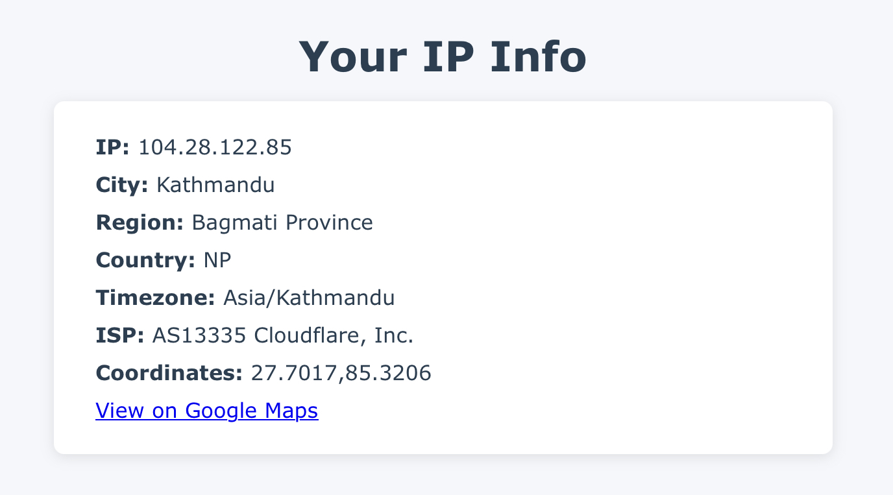

# IP Info Viewer

A lightweight, static HTML page that displays detailed information about your public IP address using the free [ipinfo.io](https://ipinfo.io) API.

## Features

- Displays your:
  - IP Address
  - City & Region
  - Country
  - Timezone
  - ISP / Organization
  - Coordinates
  - Google Maps link to your approximate location

## Live Preview

Just open the `index.html` file in any browser — no server needed!

## How It Works

This project uses vanilla JavaScript to fetch IP-related data from:

https://ipinfo.io/json

The data is then neatly displayed in a card-style layout using basic HTML and CSS.

## Screenshot



## Usage

1. Clone the repo or copy the `index.html` file.
2. Open it in your browser.
3. Boom! IP info right there.

## Optional: Use Your Own API Token

You can sign up for a free account at [ipinfo.io](https://ipinfo.io/signup) to get an API token if you hit rate limits.

Update this line in the JavaScript:

```javascript
fetch('https://ipinfo.io/json?token=your_token_here')
```

No Tracking, No Backend, No Data Stored

This is fully client-side. None of your data is stored or sent anywhere except to ipinfo.io.

License

MIT License. Free to use, tweak, and share.

⸻

Made with curiosity and caffeine.
